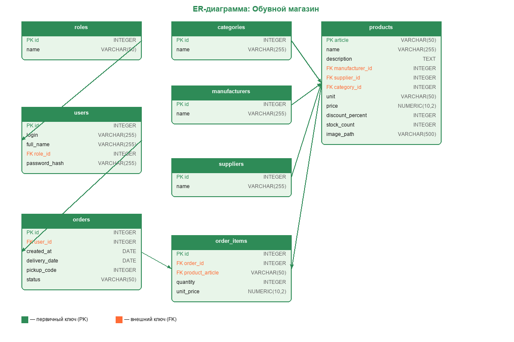

<p align="center">
<svg width="128" height="128" viewBox="0 0 200 200" fill="none" xmlns="http://www.w3.org/2000/svg">
<rect x="20" y="20" width="160" height="160" fill="#7FFF00" stroke="black" stroke-width="8"/>
<path d="M60 140H140V120H150V100H130V110H90V80H60V140Z" fill="black"/>
<rect x="70" y="140" width="10" height="10" fill="black"/><rect x="90" y="140" width="10" height="10" fill="black"/><rect x="110" y="140" width="10" height="10" fill="black"/><rect x="130" y="140" width="10" height="10" fill="black"/>
<rect x="70" y="130" width="60" height="5" fill="#00FA9A"/>
<rect x="80" y="90" width="20" height="4" fill="#7FFF00"/><rect x="80" y="100" width="20" height="4" fill="#7FFF00"/>
</svg>
</p>

# shoestore - решение mdk1101

это законченная информационная система магазина обуви, собранная как web-версия и desktop-версия с общим backend. вместо ожидаемого `.net` здесь использован другой стек: `fastapi + react + tauri + sqlite`. задача закрыта как полноценное приложение, а не как статический макет.

## что требовалось по тз и как это выполнено

1. задание 1, база данных и импорт данных:
   - в тз требовалось подготовить импорт из файлов заказчика, нормализовать структуру и вынести связанные сущности в отдельные таблицы.
   - в коде это выполнено через `solution/backend/app/importer.py`, `solution/backend/app/seed.py`, `solution/backend/app/models.py`, `solution/backend/app/crud.py`.
   - состав заказа вынесен в отдельную таблицу позиций заказа, а справочники производителей, поставщиков и категорий реализованы отдельными сущностями.
   - база построена в sqlite, схема хранится в `solution/database/schema.sql`.
   - erd сохранена в `solution/database/erd.png` и отображается ниже прямо в `README.md`.
   - исходник схемы для пересборки лежит в `solution/database/generate_erd.py`.
   - исходные файлы импорта лежат в `Задание/import`, а выгрузки таблиц после импорта - в `solution/database/exports`.

   

2. задание 2, решение и библиотека классов:
   - в тз требовалось собрать решение с библиотекой классов, веб-api, веб-приложением и оконным приложением.
   - в проекте роль общего слоя выполняет `solution/shared`: здесь лежат общие страницы, ui-компоненты, api-обвязка, типы и вспомогательная логика.
   - backend вынесен в `solution/backend`, web-клиент - в `solution/web`, desktop-клиент - в `solution/desktop`.
   - общий код не дублируется между web и desktop, а подключается из shared-слоя.

3. задание 3, веб-api:
   - в тз требовались авторизация по логину и паролю с jwt, работа с товарами и работа с заказами.
   - в коде это реализовано в `solution/backend/app/main.py`, `solution/backend/app/security.py`, `solution/backend/app/schemas.py`, `solution/backend/app/crud.py`.
   - есть эндпоинты для логина, регистрации и получения текущего пользователя.
   - есть эндпоинты для получения всех товаров, товара по артикулу, создания, обновления и удаления товара.
   - есть эндпоинты для получения заказов пользователя, получения всех заказов и изменения статуса/даты доставки заказа.
   - права доступа разделены по ролям: клиент, менеджер, админ.

4. задание 4, просмотр списка товаров в web-приложении:
   - в тз требовалось отображать товары с фотографиями, заглушкой `picture.png`, ценой со скидкой, поиском, фильтрами и сортировкой.
   - это реализовано в `solution/shared/src/pages/Catalog/CatalogPage.tsx`, `solution/shared/src/components/Catalog/ProductCard.tsx`, `solution/shared/src/catalog.ts`, `solution/shared/src/api.ts`.
   - в каталоге есть поиск по части описания, фильтр по производителю, фильтр по максимальной цене, переключатели "только со скидкой" и "только в наличии", а также сортировка.
   - в карточках показываются изображение, исходная цена, цена после скидки и значения из связанных таблиц вместо id.
   - если изображения нет, используется `picture.png`.

5. задание 5, работа с заказами в web-приложении:
   - в тз требовались авторизация, отображение фио пользователя, выход из системы, оформление заказа у гостя и просмотр заказов по ролям.
   - это реализовано в `solution/shared/src/App.tsx`, `solution/shared/src/pages/Auth/LoginPage.tsx`, `solution/shared/src/pages/Auth/RegisterPage.tsx`, `solution/shared/src/pages/Orders/OrdersPage.tsx`.
   - после входа имя пользователя отображается в интерфейсе, а сессия хранится локально.
   - гость при нажатии "заказать" переходит на страницу авторизации, а после входа заказ создается автоматически из отложенного выбора.
   - клиент видит только свои заказы, менеджер и администратор видят весь список заказов.
   - таблица заказов содержит номер, состав, дату заказа, дату доставки, код получения, статус и итоговую стоимость.

6. задание 6, работа с товарами в оконном приложении:
   - в тз требовалось создать оконное приложение с логином первым экраном, списком товаров и правами на редактирование для менеджера и администратора.
   - это реализовано в `solution/desktop/src/App.tsx`, `solution/desktop/src-tauri/tauri.conf.json` и общих страницах из `solution/shared`.
   - desktop-версия использует tauri, имеет отдельный titlebar и нативные кнопки окна.
   - логин действительно является первым экраном, а после авторизации открывается каталог.
   - для менеджера и администратора доступны создание, редактирование и удаление товаров.
   - изображения товаров можно добавлять и заменять, а путь к файлу хранится в базе.
   - после изменения товара список обновляется.

## что находится в репозитории

- `solution/backend` - backend на fastapi, работающий с sqlite через sqlalchemy.
- `solution/web` - web-клиент на react 19 + vite + typescript.
- `solution/desktop` - desktop-клиент на tauri 2.
- `solution/shared` - общие страницы, ui, типы, api-обвязка и логика для клиентской части.
- `solution/database` - sql-схема, erd и csv-экспорты.
- `Задание/import` - исходные excel-файлы для заполнения базы.
- `solution/backend/tests` - api-тесты на pytest.
- `scratch` - служебные скрипты для анализа и подготовки данных.

## что реализовано

- регистрация и вход с jwt-сессией.
- роли `admin`, `manager`, `client`.
- каталог товаров с поиском, фильтрами, сортировкой и пагинацией.
- карточка товара с переходом в детальный экран.
- оформление заказа из каталога и из карточки товара.
- личные заказы для клиента.
- полный список заказов для `admin` и `manager`.
- смена статуса и даты доставки заказа для `admin` и `manager`.
- создание, редактирование и удаление товаров для `admin` и `manager`.
- импорт товаров из `csv` и `xlsx` с предпросмотром.
- автоматическое заполнение базы при старте из исходных excel-файлов.
- единый визуальный стиль для web и desktop.
- кастомный titlebar и window controls в desktop-версии.

## стек

### backend

- python 3.11+
- fastapi
- sqlalchemy
- sqlite
- pydantic v2
- python-jose
- passlib
- pandas
- openpyxl

### frontend

- react 19
- typescript
- vite
- tailwind css 4
- shadcn/ui
- radix ui
- framer motion

### desktop

- tauri 2
- rust runtime для нативной оболочки и управления окном

## структура решения

- backend поднимается из `solution/backend/run.py`.
- база данных создается в `solution/backend/shoe_store.db`.
- api доступен на `http://127.0.0.1:8000`.
- web и desktop в dev-режиме ходят в backend через vite proxy.
- если нужен отдельный production-сборочный сценарий, для фронта можно задать `VITE_API_URL`.

## как запустить

### 1. backend

```bash
cd solution/backend
python -m venv .venv

# windows
.venv\Scripts\activate

# linux / mac
source .venv/bin/activate

pip install -r requirements.txt
python run.py
```

после старта api будет доступен по адресу `http://127.0.0.1:8000`.

### 2. web

```bash
cd solution/web
npm install
npm run dev
```

vite поднимет клиент и автоматически проксирует запросы на backend.

### 3. desktop

```bash
cd solution/desktop
npm install
npm run tauri dev
```

desktop-версия использует тот же backend и тот же набор api-методов.

### 4. тесты backend

```bash
cd solution/backend
pytest
```

## тестовые аккаунты

после первого запуска backend база заполняется автоматически. ниже - готовые логины из seed-данных.

| роль | фио | логин | пароль |
| :--- | :--- | :--- | :--- |
| админ | никифорова весения николаевна | 94d5ous@gmail.com | uzWC67 |
| админ | сазонов руслан германович | uth4iz@mail.com | 2L6KZG |
| админ | одинцов серафим артёмович | yzls62@outlook.com | JIFRCZ |
| менеджер | степанов михаил артёмович | 1diph5e@tutanota.com | 8ntwUp |
| менеджер | ворсин петр евгеньевич | tjde7c@yahoo.com | YOyhfr |
| менеджер | старикова елена павловна | wpmrc3do@tutanota.com | RSbvHv |
| клиент | михайлюк анна вячеславовна | 5d4zbu@tutanota.com | rwVDh9 |
| клиент | ситдикова елена анатольевна | ptec8ym@yahoo.com | LdNyos |
| клиент | ворсин петр евгеньевич | 1qz4kw@mail.com | gynQMT |
| клиент | старикова елена павловна | 4np6se@mail.com | AtnDjr |

## отчет по работе

1. я переписал `README.md` в едином нижнем регистре, без пустой рекламы и лишней воды.
2. я добавил честное описание стека и прямо зафиксировал, что это не `.net`, а решение на `fastapi + react + tauri + sqlite`.
3. я разложил репозиторий по папкам, чтобы сразу было видно, где backend, где web, где desktop и где общие части.
4. я описал фактические возможности системы: авторизация, роли, каталог, заказы, управление товарами, импорт данных и desktop-оболочка.
5. я добавил точные команды запуска для backend, web и desktop, а также отдельную команду для backend-тестов.
6. я оставил таблицу тестовых аккаунтов, чтобы можно было сразу проверять проект после старта.

## коротко о сути

это рабочее приложение магазина обуви с единым backend, браузерным клиентом и desktop-сборкой. если преподаватель ждал именно `.net`, то по платформе решение отличается, но по функциональности это законченная прикладная система, а не черновик или прототип.
