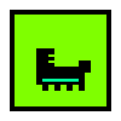

<p align="center">
  
</p>

# shoestore — решение mdk1101

это полноценный стек из бэкенда на fastapi, веб-морды на react и десктопного приложения через tauri. всё упаковано, типизировано и разбито на модули. дизайн — чистый брутализм, код — чистый кайф.

## 📦 структура проекта

проект разбит на логические блоки, чтобы не превращаться в кашу:

- **solution/backend** — питоновский сервак на fastapi. тянет базу на sqlite, рулит авторизацией и раздает данные.
- **solution/web** — фронтенд на react 19. тут живет вся логика каталога, фильтров и личного кабинета.
- **solution/desktop** — то же самое что и веб, но завернуто в tauri для работы на компе как отдельное приложение.
- **solution/shared** — общее ядро фронтенда. страницы, компоненты и апи вынесены сюда, чтобы не дублировать код между вебом и десктопом.
- **solution/database** — тут лежат скрипты инициализации, sql-схемы и ERD-диаграммы базы данных.
- **scratch** — папка с моими сервисными скриптами для анализа и рефакторинга.

## 🚀 как запустить

### 1. бэкенд
заходим в папку бэка, создаем виртуальное окружение и запускаем:
```bash
cd solution/backend
python -m venv .venv

# на винде:
.venv\Scripts\activate
# на линуксе/маке:
source .venv/bin/activate

pip install -r requirements.txt
python run.py
```
после этого апи будет висеть на `http://127.0.0.1:8000`.

### 2. веб
нужен node.js (актуальной версии):
```bash
cd solution/web
npm install
npm run dev
```

### 3. десктоп
если есть установленный rust, можно запустить tauri:
```bash
cd solution/desktop
npm install
npm run tauri dev
```

## 🛠 технологии

### бэкенд
- **python 3.11+**
- **fastapi** — для быстрых и типизированных эндпоинтов.
- **sqlalchemy** — чтобы общаться с базой без боли.
- **python-jose** — для jwt токенов и безопасности.
- **sqlite** — простая и быстрая база в файле.

### фронтенд (веб и десктоп)
- **react 19** + **typescript** — строгая типизация везде.
- **vite** — мгновенный запуск и сборка.
- **tailwind css** — стили прямо в разметке.
- **shadcn/ui** — готовые компоненты в стиле брутализма.
- **framer motion** — для плавных переходов и анимаций.

## ✨ фичи

- **каталог товаров**: поиск, фильтры по брендам, цене, наличию.
- **умная корзина**: если нажать «заказать» без логина, приложение запомнит выбор и предложит оформить всё сразу после входа.
- **авторизация**: полноценная регистрация и вход, сессия живет в локалсторедже.
- **роли**: разделение на клиентов, менеджеров и админов. у админов есть доступ к управлению статусами.
- **архитектура**: фронт разбит на слои (api, types, lib, components, pages). никакой каши.
- **визуал**: темная/светлая темы, скелетоны на загрузке, плавные анимации появления карточек.

## ✍️ стиль
код прокомментирован максимально подробно в разговорном стиле. каждый важный кусок логики объяснен простыми словами, чтобы было понятно не только компьютеру, но и человеку. комментарии на русском и в нижнем регистре.

